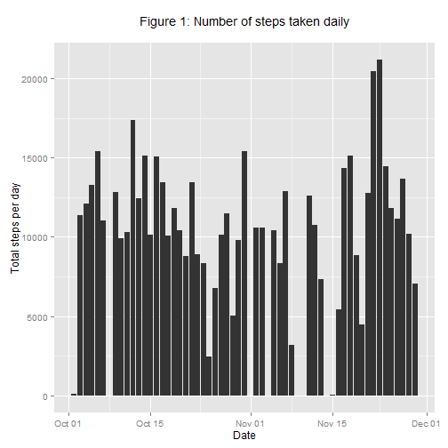
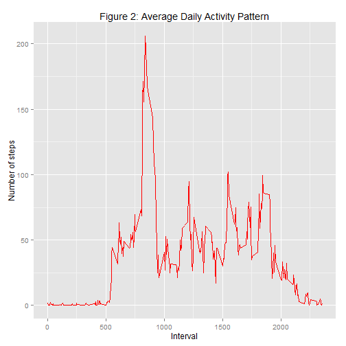
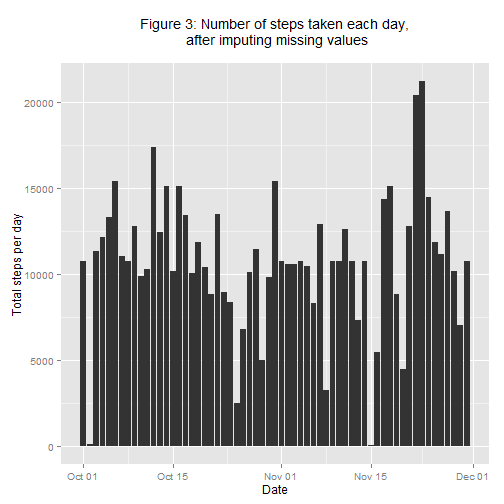
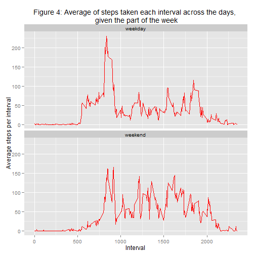

---
output:
  html_document: default
---
Reprodicible Research: Peer Assessment 1
=====================================================

This document was created for Coursera Reproduciable Research courser's Peer Assesment 1
The assignment needs downloading the data, analysing the data using R programming generating the output in specified file types. And submit the output file for peer assesment using Github.

This assignment makes use of data from a personal activity monitoring device. This device collects data at 5 minute intervals through out the day. The data consists of two months of data from an anonymous individual collected during the months of October and November, 2012 and include the number of steps taken in 5 minute intervals each day.

### Initial Steps

First, we have to fork the repository from [here](https://github.com/rdpeng/RepData_PeerAssessment1), created for the assignment.
This repository contains all the files needed for the assignment. so, no need to download the data seperately.
Then, you need to pull this repository to your local computer, on which you would be working on. (prferably to the working directory)
Make sure that you set the working directory to the pulled local repository.

## Data Analysis

First, load all the required libraries.


```r
library(ggplot2)
```

###Loading and preprocessing the data###

unzip the file


```r
unzip("activity.zip")
```

Read the file using read.csv()


```r
activity<-read.csv("activity.csv")
```

Formate the data, convert the date column to date object


```r
activity$date<-as.Date(activity$date)
```

The transformed data is as shown in the sample below


```r
head(activity)
```

```
##   steps       date interval
## 1    NA 2012-10-01        0
## 2    NA 2012-10-01        5
## 3    NA 2012-10-01       10
## 4    NA 2012-10-01       15
## 5    NA 2012-10-01       20
## 6    NA 2012-10-01       25
```

###What is mean total number of steps taken per day?###

We ignore the missing values in the data and proceed to calculate the total steps per day.


```r
steps.date <- aggregate(steps ~ date, data = activity, FUN = sum)
```

We now plot total steps versus the date and the **histogram** that result is as shown in the Figure:1 below


```r
qplot(x=date, y=steps,data=subset(activity, complete.cases(activity)),
      stat='summary', fun.y=sum, geom='bar') +
  labs(title='Figure 1: Number of steps taken daily\n',
       y='Total steps per day', x='Date')
```

 

Now we calculate and report the **mean** and **median** of total number of steps per day.


```r
mean(steps.date$steps)
```

```
## [1] 10766.19
```


```r
median(steps.date$steps)
```

```
## [1] 10765
```

###What is the average daily activity pattern?###

We aggreggate the number of steps taken, averaged across all days for each 5 minute interval


```r
steps.interval <- aggregate(steps ~ interval, data = activity, FUN = mean)
```

We now plot time series plot of the 5-minute interval on x-axis and the average number of steps taken, averaged across all days on y-axis


```r
ggplot(steps.interval, aes(x=interval, y=steps)) +geom_line(color="red", size=.5) +labs(title="Figure 2: Average Daily Activity Pattern", x="Interval", y="Number of steps")
```

 

We now calculate the 5 minute interval which contains the higest number of steps


```r
steps.interval$interval[which.max(steps.interval$steps)]
```

```
## [1] 835
```

###Imputing missing values###

Calculate the total number of missing values in the dataset, that needs to be filled


```r
sum(is.na(activity))
```

```
## [1] 2304
```

For imputation of these missing values, we can choose to replace the NA values with the 5 minute interval mean.


```r
activity <- merge(activity, steps.interval, by = "interval", suffixes = c("",".y"))
nas <- is.na(activity$steps)
activity$steps[nas] <- activity$steps.y[nas]
activity <- activity[, c(1:3)]
```

We create a data frame which is equal to the original dataframe but with all the missing values filled

aggregate steps as per date to get total number of steps in a day


```r
steps.date <- aggregate(steps ~ date, data = activity, FUN = sum)
```

We now plot a graph of total number of steps versus the date. And the resulting **histogram** is as shown in the figure below


```r
qplot(x=date, y=steps, data=subset(activity, complete.cases(activity)),stat='summary', fun.y=sum, geom='bar') +
  labs(title='Figure 3: Number of steps taken each day,\n after imputing missing values\n', y='Total steps per day', x='Date')
```

 

We now calculate the **mean** and the **median** after imputing the missing values


```r
mean(steps.date$steps)
```

```
## [1] 10766.19
```


```r
median(steps.date$steps)
```

```
## [1] 10766.19
```

The impact of missing values in this case seems to be rather low.

###Are there differences in activity patterns between weekdays and weekends?###

We create a new factor variable in the dataset- **"weekday"** and **weekend**, using the *weekdays()* function


```r
daytype <- function(date) {
  if (weekdays(as.Date(date)) %in% c("Saturday", "Sunday")) {
    "weekend"
  } else {
    "weekday"
  }
}
activity$daytype <- as.factor(sapply(activity$date, daytype))
```

aggregate steps as interval to get average number of steps in an interval across all days


```r
new <- aggregate(steps ~ interval + daytype, activity, mean)
```

We now create a panel plot containing a time series plot of the 5-minute interval on x-axis and the average number of steps taken, averaged across all weekday days or weekend days on y-axis.


```r
ggplot(new, aes(x=interval, y=steps)) +geom_line(color="red", size=.5) +
  labs(title="Figure 4: Average of steps taken each interval across the days, \n given the part of the week", x="Interval", y="Average steps per interval") + facet_wrap(~ daytype, nrow=2, ncol=1)
```

 


